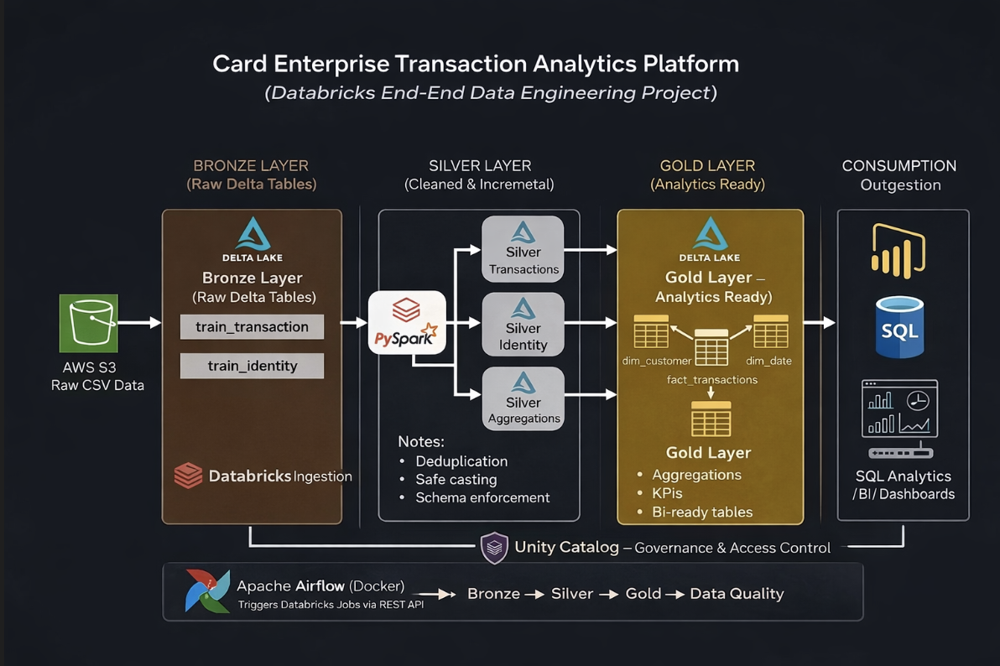

# Enterprise Databricks + Airflow Medallion Pipeline

## Overview

This project implements an enterprise-grade, end-to-end data engineering pipeline built using Databricks, Delta Lake, and Apache Airflow, following the Medallion Architecture (Bronze → Silver → Gold). The pipeline ingests raw transactional data from an AWS S3–like source, processes it using distributed Spark workloads on Databricks, applies incremental transformations and data quality validations, and produces analytics-ready datasets optimized for business intelligence and reporting use cases.

Apache Airflow, running in a fully Dockerized environment, orchestrates the entire workflow by triggering Databricks notebooks via REST APIs. The design emphasizes scalability, fault tolerance, and maintainability, while closely aligning with real-world, production-grade data engineering best practices. Although the implementation may run in constrained environments such as Databricks Community Edition, the overall architecture mirrors enterprise cloud deployments.

---

## Architecture

**Pipeline Flow:**

AWS S3 (Raw Data)  
→ Bronze Layer (Raw Delta Tables)  
→ Silver Layer (Cleaned & Incremental Transformations)  
→ Gold Layer (Aggregations & Star Schema)  
→ Data Quality Checks  
→ BI / Analytics Consumption

---

## Tech Stack

- **Databricks** – Distributed data processing and analytics  
- **Delta Lake** – ACID-compliant storage for Bronze, Silver, and Gold layers  
- **PySpark** – Large-scale data transformations and enrichment  
- **Apache Airflow** – Workflow orchestration and scheduling  
- **Docker & Docker Compose** – Containerized Airflow deployment  
- **AWS S3** – Conceptual raw data source  
- **SQL** – Analytics, aggregations, and validation logic  

---

## Key Features

- Medallion Architecture implementation (Bronze / Silver / Gold)
- Incremental processing using Delta Lake `MERGE` logic
- Schema enforcement and tolerant casting for real-world dirty data
- Dedicated Data Quality (DQ) validation layer
- Airflow DAG orchestration with clear task dependencies
- Databricks Jobs triggered via REST API
- Enterprise-ready folder and notebook structure
- Production-aligned design principles

---

## How to Run

1. Configure the Databricks connection in Airflow
2. Start Airflow using Docker Compose
3. Open Airflow UI at `http://localhost:8080`
4. Trigger the pipeline DAG manually or via schedule

---

## Author

**Ajay Raj Velidi**
